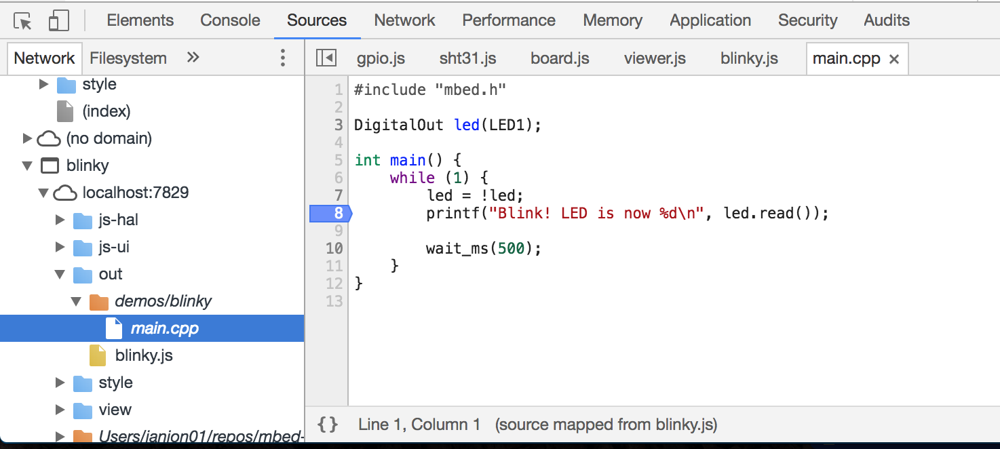
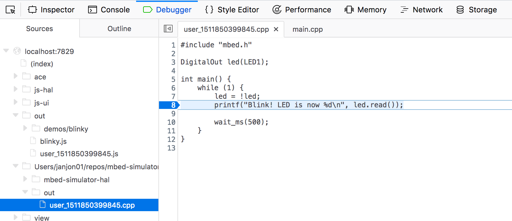

# Debugging

Simulator applications can be debugged using your browser's debugger, because they contain source maps. To debug an application:

**Chrome**

1. Open the Developer Tools via **View > Developer > Developer Tools**.
1. Click **Sources**.
1. Under 'Network', select the name of the application (see the browser hash).
1. Now locate `main.cpp`.
    * On a pre-built demo, go to the `out` folder, select the name of the demo (e.g. `blinky`) and select `main.cpp`.
    * On a user-compiled app, go to the *orange* folder, go to the `out` folder, and select `main.cpp`.
1. Click in the gutter to add a breakpoint.
1. Click the **↻** icon in the simulator to restart the debug session.

**Firefox**

1. Open the Developer Tools via **Tools > Web Developer > Toggle Tools**.
1. Click **Debugger**.
1. Now locate `main.cpp`.
    * On a pre-built demo, go to the `out` folder, select the name of the demo (e.g. `demos/blinky`) and select `main.cpp`.
    * On a user-compiled app, go to the folder that starts with `/home/ubuntu`, go to the `out` folder, and select `user_XXX.cpp`.
1. Click in the gutter to add a breakpoint.
1. Click the **↻** icon in the simulator to restart the debug session.